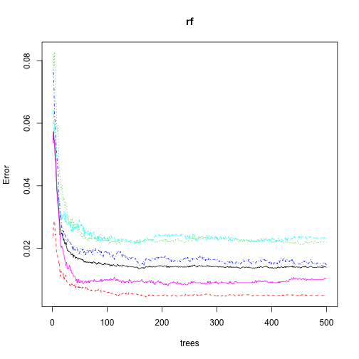
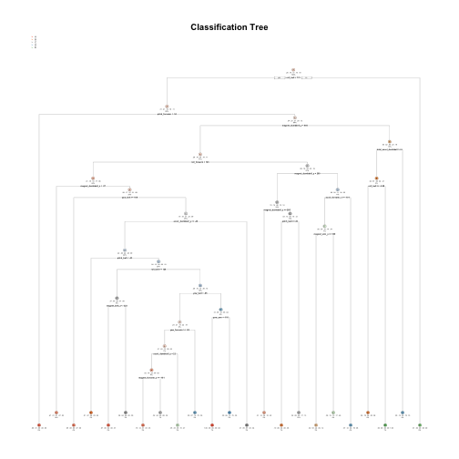

## Synopsis

This project writeup: how you built your model, how you used cross validation, what you think the expected out of sample error is, and why you made the choices you did. You will also use your prediction model to predict 20 different test cases.

## Data Source

### Background

Using devices such as Jawbone Up, Nike FuelBand, and Fitbit it is now possible to collect a large amount of data about personal activity relatively inexpensively. These type of devices are part of the quantified self movement – a group of enthusiasts who take measurements about themselves regularly to improve their health, to find patterns in their behavior, or because they are tech geeks. One thing that people regularly do is quantify how much of a particular activity they do, but they rarely quantify how well they do it. In this project, your goal will be to use data from accelerometers on the belt, forearm, arm, and dumbell of 6 participants. They were asked to perform barbell lifts correctly and incorrectly in 5 different ways. More information is available from the website here: http://web.archive.org/web/20161224072740/http:/groupware.les.inf.puc-rio.br/har (see the section on the Weight Lifting Exercise Dataset).

The training data for this project are available here:

https://d396qusza40orc.cloudfront.net/predmachlearn/pml-training.csv [Mirror site]

The test data are available here:

https://d396qusza40orc.cloudfront.net/predmachlearn/pml-testing.csv [Mirror site]

## Data Prosessing

### Load Packages


```r
library(caret)

set.seed(3301)
```

### Read and PreProsessing Data

```r
pmlTraining <- read.csv("./data/pml-training.csv", na.strings = c("", "NA", "#DIV/0!"))
pmlTesting <- read.csv("./data/pml-testing.csv", na.strings = c("", "NA", "#DIV/0!"))

dim(pmlTraining)
```

```
## [1] 19622   160
```

```r
dim(pmlTesting)
```

```
## [1]  20 160
```


```r
table(pmlTraining$classe)
```

```
## 
##    A    B    C    D    E 
## 5580 3797 3422 3216 3607
```
Any columns that will not be needed for the final analysis will be removed to make the dataset easy to use.

```r
noUseColumns = c(1:7, 12:36, 50:59, 69:83, 87:101, 103:112, 125:139, 141:150)
pmlTraining <- pmlTraining[, -noUseColumns]
pmlTesting <- pmlTesting[, -noUseColumns]
```

Extract testing data from `pml-training.csv`.

```r
index <- createDataPartition(pmlTraining$classe, p = .8, list = FALSE)
trainData <- pmlTraining[index, ]
testData <- pmlTraining[-index, ]
```

## Prediction Model Building

### Random Forest


```r
library(randomForest)
```

Find best value of mtry.

```r
# Note that this function takes about 20 minutes. The results were below.
# tuneRF(trainData[, -1], trainData[, 1], doBest = TRUE)

# mtry = 17  OOB error = 0.6441513 
# Searching left ...
# mtry = 9 	OOB error = 0.6222891 
# 0.03393964 0.05 
# Searching right ...
# mtry = 34 	OOB error = 0.4463682 
# 0.3070446 0.05 
# mtry = 52 	OOB error = 0.439003 
# 0.01650017 0.05 
# 
# Call:
#  randomForest(x = x, y = y, mtry = res[which.min(res[, 2]), 1]) 
#                Type of random forest: regression
#                      Number of trees: 500
# No. of variables tried at each split: 52
# 
#           Mean of squared residuals: 0.3351257
#                     % Var explained: 99.99
```

Make a predict model using a random forest.

```r
rf <- randomForest(classe ~ ., data = trainData, mtry = 52)

plot(rf)
```



Test our model performance on cross validation set.

```r
predictRf <- predict(rf, testData, type = "class")
confusionMatrix(predictRf, testData$classe)
```

```
## Confusion Matrix and Statistics
## 
##           Reference
## Prediction    A    B    C    D    E
##          A 1112    7    2    0    0
##          B    1  749    4    0    2
##          C    1    2  672    8    1
##          D    1    0    6  634    1
##          E    1    1    0    1  717
## 
## Overall Statistics
##                                           
##                Accuracy : 0.9901          
##                  95% CI : (0.9864, 0.9929)
##     No Information Rate : 0.2845          
##     P-Value [Acc > NIR] : < 2.2e-16       
##                                           
##                   Kappa : 0.9874          
##  Mcnemar's Test P-Value : NA              
## 
## Statistics by Class:
## 
##                      Class: A Class: B Class: C Class: D Class: E
## Sensitivity            0.9964   0.9868   0.9825   0.9860   0.9945
## Specificity            0.9968   0.9978   0.9963   0.9976   0.9991
## Pos Pred Value         0.9920   0.9907   0.9825   0.9875   0.9958
## Neg Pred Value         0.9986   0.9968   0.9963   0.9973   0.9988
## Prevalence             0.2845   0.1935   0.1744   0.1639   0.1838
## Detection Rate         0.2835   0.1909   0.1713   0.1616   0.1828
## Detection Prevalence   0.2858   0.1927   0.1744   0.1637   0.1835
## Balanced Accuracy      0.9966   0.9923   0.9894   0.9918   0.9968
```
Accuracy for Random Forest model was 0.9901. It's a very high accuracy, but we will try another model for confirmation in next section.

Let's also look at the importance of each explanatory variable.

```r
importance(rf)
```

```
##                      MeanDecreaseGini
## roll_belt                  1983.54842
## pitch_belt                  742.13465
## yaw_belt                    874.75760
## total_accel_belt             23.10395
## gyros_belt_x                 35.24198
## gyros_belt_y                 30.60821
## gyros_belt_z                201.49440
## accel_belt_x                 33.24639
## accel_belt_y                 18.00182
## accel_belt_z                 73.29585
## magnet_belt_x               175.16931
## magnet_belt_y               179.02161
## magnet_belt_z               314.38636
## roll_arm                    100.72550
## pitch_arm                    80.59516
## yaw_arm                     211.03782
## total_accel_arm              31.88554
## gyros_arm_x                  50.49976
## gyros_arm_y                 106.05297
## gyros_arm_z                  18.26191
## accel_arm_x                  98.28274
## accel_arm_y                  65.37229
## accel_arm_z                  47.05580
## magnet_arm_x                 62.11990
## magnet_arm_y                130.77965
## magnet_arm_z                 88.61740
## roll_dumbbell               250.03220
## pitch_dumbbell               54.91214
## yaw_dumbbell                141.57401
## total_accel_dumbbell        379.75946
## gyros_dumbbell_x             69.09517
## gyros_dumbbell_y            117.43322
## gyros_dumbbell_z             41.74559
## accel_dumbbell_x             47.25357
## accel_dumbbell_y            417.96010
## accel_dumbbell_z            305.63559
## magnet_dumbbell_x           181.13140
## magnet_dumbbell_y           830.84123
## magnet_dumbbell_z           674.17183
## roll_forearm                840.86470
## pitch_forearm              1078.03382
## yaw_forearm                 171.91261
## total_accel_forearm          38.08059
## gyros_forearm_x              21.96286
## gyros_forearm_y              57.97007
## gyros_forearm_z              45.79046
## accel_forearm_x             318.04494
## accel_forearm_y              53.57784
## accel_forearm_z              96.76048
## magnet_forearm_x             56.60798
## magnet_forearm_y             65.56432
## magnet_forearm_z            279.17194
```

### Decision Tree


```r
library(rpart)
```

Make a predict model using a decision tree.

```r
dt <- rpart(classe ~ ., data = trainData, method = "class")
```

Test our model performance on cross validation set.

```r
predictDt <- predict(dt, testData, type = "class")
confusionMatrix(predictDt, testData$classe)
```

```
## Confusion Matrix and Statistics
## 
##           Reference
## Prediction    A    B    C    D    E
##          A 1042  170   21   68   38
##          B   25  394   57   28   54
##          C   19   69  540   98   71
##          D   14   58   44  397   43
##          E   16   68   22   52  515
## 
## Overall Statistics
##                                           
##                Accuracy : 0.7362          
##                  95% CI : (0.7221, 0.7499)
##     No Information Rate : 0.2845          
##     P-Value [Acc > NIR] : < 2.2e-16       
##                                           
##                   Kappa : 0.664           
##  Mcnemar's Test P-Value : < 2.2e-16       
## 
## Statistics by Class:
## 
##                      Class: A Class: B Class: C Class: D Class: E
## Sensitivity            0.9337   0.5191   0.7895   0.6174   0.7143
## Specificity            0.8942   0.9482   0.9207   0.9515   0.9507
## Pos Pred Value         0.7782   0.7061   0.6775   0.7140   0.7652
## Neg Pred Value         0.9714   0.8915   0.9539   0.9269   0.9366
## Prevalence             0.2845   0.1935   0.1744   0.1639   0.1838
## Detection Rate         0.2656   0.1004   0.1376   0.1012   0.1313
## Detection Prevalence   0.3413   0.1422   0.2032   0.1417   0.1716
## Balanced Accuracy      0.9139   0.7336   0.8551   0.7845   0.8325
```
Accuracy for Decision Tree model was 0.7362. It was not good value.


```r
library(rpart.plot)
```

```r
rpart.plot(dt, main = "Classification Tree", under = TRUE, faclen = 0)
```




## Applying prediction model
Applying prediction model to test data set.

```r
predict(rf, pmlTesting, type = "class")
```

```
##  1  2  3  4  5  6  7  8  9 10 11 12 13 14 15 16 17 18 19 20 
##  B  A  B  A  A  E  D  B  A  A  B  C  B  A  E  E  A  B  B  B 
## Levels: A B C D E
```

## References

1. Groupware@LES Projects Human Activity Recognition
http://web.archive.org/web/20161224072740/http:/groupware.les.inf.puc-rio.br/har

2. Velloso, E.; Bulling, A.; Gellersen, H.; Ugulino, W.; Fuks, H. [Qualitative Activity Recognition of Weight Lifting Exercises](http://web.archive.org/web/20161224072740/http:/groupware.les.inf.puc-rio.br/work.jsf?p1=11201). Proceedings of 4th International Conference in Cooperation with SIGCHI (Augmented Human '13) . Stuttgart, Germany: ACM SIGCHI, 2013.

3. Ugulino, W.; Cardador, D.; Vega, K.; Velloso, E.; Milidiu, R.; Fuks, H. [Wearable Computing: Accelerometers' Data Classification of Body Postures and Movements](http://web.archive.org/web/20161224072740/http:/groupware.les.inf.puc-rio.br/work.jsf?p1=10335). Proceedings of 21st Brazilian Symposium on Artificial Intelligence. Advances in Artificial Intelligence - SBIA 2012. In: Lecture Notes in Computer Science. , pp. 52-61. Curitiba, PR: Springer Berlin / Heidelberg, 2012. ISBN 978-3-642-34458-9. DOI: 10.1007/978-3-642-34459-6_6. 
Cited by 2 (Google Scholar)
